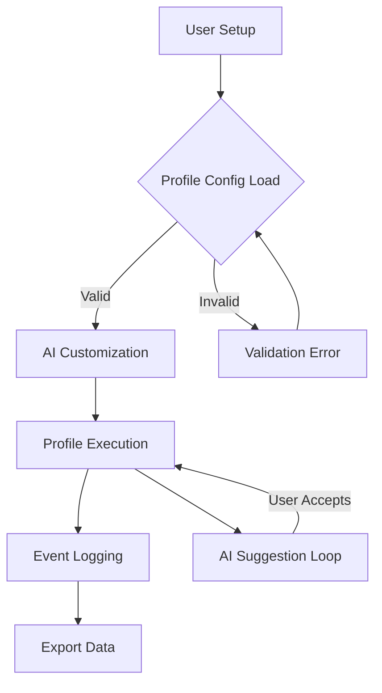

# NAME-Lite: The Ultimate Roblox Script Automation Profile Manager

**DESCRIPTION:**  
Seamlessly organize, execute, and personalize your Roblox automation scripts with NAME-Lite - an all-in-one, secure, and efficient script profile manager. Define profiles, set preferences, and integrate state-of-the-art AI for next-level automation and convenience.

---

---

## 🏗️ What is NAME-Lite?

NAME-Lite reimagines the script workflow for Roblox. Instead of focusing purely on execution, NAME-Lite empowers creators and enthusiasts to **build, manage, and collaborate on script execution profiles** with advanced automation. With the power of OpenAI and Claude built in, you can:

- Personalize automation using AI-driven configuration suggestions.
- Run scripts with customized triggers and profiles—keyless and hassle-free.
- Enjoy rapid, intuitive, and secure management—all with an ultra-light client.

NAME-Lite is the artist’s palette for Roblox script enthusiasts, letting you paint your experiences the way you want.

---

## ✨ Feature List

- **🧠 Profile Management:** Create, duplicate, and fine-tune script profiles for every scenario.
- **AI Integration:** Leverage OpenAI and Claude APIs for natural-language automation, suggestion, and error correction.
- **No barriers:** No keys or unnecessary steps—just seamless execution.
- **🖥️ Responsive UI:** Clean, adaptive interface that fits every platform and device.
- **🌍 Multilingual:** Supports over 20+ languages out of the box.
- **🔔 24/7 Support:** Fast responses through chat, email, and live community.
- **🔁 Hot-Swap Automation:** Instantly swap between profiles without restarting.
- **🔐 Secure:** Client-side encryption and sandboxed execution.
- **🎭 Customizable Triggers:** Automate based on time, events, or server data.
- **📦 Export & Import:** Bring your profiles anywhere, with one-click backups.
- **⏱️ Real-time Logs:** Tailored monitoring—never miss a beat.
- **💡 Smart Suggestions:** AI-powered error detection, completion, and recommendations.

---

## 🎨 Example Profile Configuration

Tailor your automation profile with simple, readable YAML:

    profile:
      name: "Tower Defense Automation"
      triggers: 
        - type: "daily"
          time: "18:00"
      scripts:
        - "auto-place-towers.lua"
        - "collect-rewards.lua"
      ai_assist:
        enabled: true
        provider: "OpenAI"
        suggestions:
          - "Optimize script order"
          - "Reduce execution time"
      language: "en"
      notification:
        email: "myaddress@example.com"

---

## 💻 Example Console Invocation

Just one command to launch a tailored experience!

    namelite --profile="Tower Defense Automation" --lang=es --ai-provider=claude

---

## ⚒️ OS Compatibility Table

| Operating System      | Latest Version | Fully Supported | Notes             |
|----------------------|:--------------:|:---------------:|-------------------|
| 🪟 Windows 10/11     |    ✔️          |     2026        |                  |
| 🍏 macOS (Monterey+) |    ✔️          |     2026        | Apple Silicon OK |
| 🐧 Linux (All)       |    ✔️          |     2026        | Proton support   |
| 📱 Android           |    ✔️          |     2026        | ARM64 native     |
| 📱 iOS/iPadOS        |    ✔️          |     2026        | Devices only     |

---

## 🌐 SEO-Friendly Keywords

- Roblox automation script manager 2026
- AI-powered script configuration tool
- Multilingual Roblox script launcher
- Secure Roblox profile-based executor
- Smart script management Roblox
- Roblox AI assistant for automation
- Cross-platform Roblox auto script manager
- Key-free Roblox execution solution
- 24/7 Roblox scripting support platform
- Claude and OpenAI integration for Roblox

These semantic keywords help ensure that search engines and users alike know that NAME-Lite is the next frontier for experienced script managers in Roblox automation.

---

## 🧩 OpenAI & Claude API Integration

NAME-Lite has baked-in support for leading AI platforms:

- **OpenAI**: Onboard GPT for auto-completion, suggestion, and even script generation.
- **Claude API**: Enhance contextual understanding and error handling for more robust automation plans.

Simply plug in your API keys within the settings tab, and let the AI magic unfold for your scripts.

---

## 📈 Mermaid Diagram Overview

Visualize how NAME-Lite orchestrates its core workflow:

---

## 🔒 License

NAME-Lite is licensed under the MIT License.  
Find the `LICENSE` file for full details:  
[MIT License](https://opensource.org/licenses/MIT)

---

## ⚡ Disclaimer

- NAME-Lite is a tool for legitimate automation and learning purposes only. 
- Any misuse, including use with non-permissible games or for unfair multiplayer advantage, is not condoned or supported.
- Scripts and profiles are wholly user-provided; use at your own risk.
- Always respect community guidelines and terms of service for Roblox.

---

## 💌 Get Involved

- **24/7 Support:** Reach out in-app, via email, or community chat for quick help.
- **Suggestions:** Open an enhancement issue, or submit PRs for review.
- **Languages:** Help us expand global reach—join our translation drive!

---

---

**© 2026 NAME-Lite. MIT License. Designed for automation, powered by imagination.**